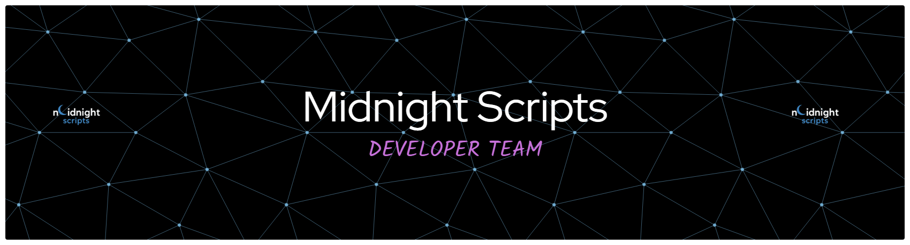

  

  

  
  
  
  
  
  

  

# 👋 Hi there / Hallo

## 🇬🇧 About Me

Hey, I'm **Midnight** 👋

I'm a developer who works on **FiveM scripts, tools, and automation**.
I enjoy creating scripts that improve roleplay servers and make gameplay more immersive.

💻 Things I work with:

* Lua
* JavaScript
* FiveM scripting
* Server development

🎯 Current focus:

* Developing FiveM scripts
* Learning new technologies
* Improving performance and optimization

🤝 I'm open for:

* Collaboration
* Script development
* Learning from other developers

---

## 🇩🇪 Über mich

Hey, ich bin **Midnight** 👋

Ich entwickle **FiveM Scripts, Tools und Automationen** für Roleplay Server.
Mein Ziel ist es, Server mit nützlichen und performanten Scripts zu verbessern.

💻 Technologien:

* Lua
* JavaScript
* FiveM Scripting
* Server Development

🎯 Aktuell arbeite ich an:

* FiveM Scripts
* neuen Technologien lernen
* Performance & Optimierung

🤝 Offen für:

* Zusammenarbeit
* Script Entwicklung
* Austausch mit anderen Entwicklern

---

## 🚀 Projects / Projekte

Hier findest du meine **FiveM Scripts und andere Projekte**.

You can find my **FiveM scripts and other projects** here.

---

## 📫 Contact

GitHub: https://github.com/MidnightScripts0

  

  
  
  
  
  
  

  

